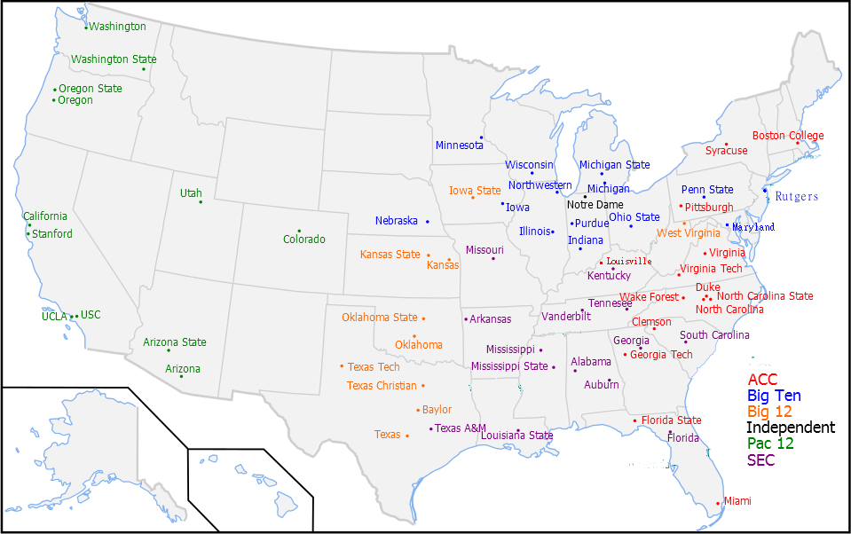

```{r}
library(dplyr)
library(cluster)
library(ggplot2)
library(maps)
```


# Introduction 
The topic I chose for my final project was conference realignment of the Power 5 college football teams. My aim was to develop 4 new super-conferences that are optimized for distance between teams and also preserves rivalries. The reason for choosing this topic is two fold, first I have a general interest and knowledge of college football, which I think will aid me in determining the best super-conference structure. Secondly, as tensions rise between the NCAA and the largest teams in college football I believe conference reordering is a eventuality in college football. As it currently stands, the NCAA’s Division I sports teams are broken up into the Power 5 conferences(ACC, Big Ten, Big 12, PAC-12, SEC) aside from a few independent schools. The following is each school mapped and colored based on its conference affiliation.

Notre Dame is shown as one of the independent schools so I decided to included it as well as BYU, another large NCAA Division I school, in my re-conferencing. The conferences have been subject to many shifts and realignments over the years, but moving away from the NCAA would be a major first in any college sport. After a short time analyzing the problem, I recognized that k-means clustering, using the latitudes and longitudes of each school, would be ideal in creating distance optimized conferences.


#Methodology 
To start my project I needed to first find the right data.  I achieved this by selecting a dataset of US cities from simplemaps.com. This dataset includes every city in the United States and is primarily a population dataset including variables such as population and density, but the important part for me was the latitude and longitude of each city.  I filtered the data in excel by eliminating all columns except city, state name, latitude and longitude. This clean data was then read into R in csv format. I grouped the data by city, state, and lat/long coordinates.  I filtered the clean data from the csv, by selecting the city and state that each team from the Power Five conferences reside in, including Notre Dame and BYU. I rewrote the csv and exported back to excel to add the team names to corresponding coordinates. The new excel file was then imported back into R to start manipulating the data. After cleaning the data I used K-means cluster analysis in order to cluster the teams based on their locations relative to each other. The K-means analysis gave me four clusters, one for each conference, but since it only optimizes for distance my next step was to look at the 4 conferences and move some teams around in order to preserve existing rivalries. Once I had the conferences that both optimized for distance and maintained rivalries I simply split each conference into two divisions based on location within the conference and created a schedule for each conference.

```{r}
location_data <- read.csv("sup_conf.csv")
location_data2 <- location_data %>% 
        group_by(city, state_name, lat,lng) %>%
        filter(city %in% c("Chestnut Hill", "
                           Greenville", 
                           "Durham", 
                           "Tallahassee", "
                           Atlanta", 
                           "Louisville", 
                           "Miami", 
                           "Chapel Hill", 
                           "Raleigh", 
                           "Pittsburgh", 
                           "Syracuse",
                           "Charlottesville", 
                           "Blacksburg", 
                           "Winston-Salem",
                           "Notre Dame", 
                           "Champaign", 
                           "Bloomington", 
                           "Iowa City", "College Park", "Ann Arbor", "East Lansing", 
                           "Minneapolis", "Lincoln", "Evanston", "Columbus", "State College", "West Lafayette", "New Brunswick",
                           "Madison", "Waco", "Ames", "Lawrence", "Manhattan", "Norman", "Stillwater", "Fort Worth", "Austin", "Lubbock", 
                           "Morgantown", "Tucson", "Tempe", "Berkeley","Tuscaloosa", "Fayetteville","Los Angeles", "Auburn","Gainesville",
                           "Athens","Denver", "Eugene", "Corvallis", "Los Angeles", "Lexington", "Baton Rouge" , "Oxford", 	"Starkville", "Columbia",
                          "Stanford", "Salt Lake City", "Seattle", "Pullman" ,	"Knoxville", "College Station", "Nashville", "Provo"))   %>%
        
    filter(state_name %in% c("Washington", "North Carolina", "Virginia", "Texas", "Oklahoma", "California", "New York", "South Carolina", "Louisiana", "Oregon", "Massachusetts", "Michigan", "Wisconson",
                                 "Arizona", "Utah", "Colorado", "Kansas", "Nebraska", "Minnesota", "Iowa", "Missouri", "Arkansas", "Illinois", "Indiana", "Kentucky", "Tennesee", "Alabama", "Florida", "Georgia"
                                  ,"West Virginia", "Ohio", "New York", "Pennsylvania", "Maryland", "New Jersey")) 

#Had to go in and manually remove some cities

team_loc <- read.csv("team_loc.csv")
```

Using K-means clustering I clustered the teams based on their latitude and longitude. This gave us 4 conferences with minimized distance to eachother. 

```{r}
loc_clust <- kmeans(team_loc[,4:5],4,nstart = 10)
clusplot(team_loc[,c(4:5)], loc_clust$cluster, color=T, lwd=2)
```


```{r}
team_loc$conf <- factor(loc_clust$cluster)
```


```{r}
states <- map_data("state")
```
Using clusters as my conferences, I plotted each team on a map of the United States.

```{r}
ggplot(data = states) + 
  geom_polygon(aes(x = long, y = lat, group = group), color = "black", fill = "white") + 
  geom_point(data = team_loc, aes(x= lng , y = lat, color = conf)) +
  coord_fixed(1.3) + 
  geom_text(data = team_loc, aes(x= lng, y = lat, label = team_name), color = "black", 
            size = 2.5, nudge_x = 0.5, nudge_y = .5) +
  theme(axis.title.x = element_blank(),
        axis.title.y = element_blank(),
        axis.text.x=element_blank(),
        axis.ticks.x=element_blank(),
        axis.text.y=element_blank(),
        axis.ticks.y =element_blank())
```

Here I built a simple counter to tell me how many teams I had in each conference.
```{r}
x <- 0
y <- 0
z <- 0
g <- 0
for (variable in team_loc$conf) {
  if (variable == "1") {
    x <- x+1
  } else if ( variable == "2") {
    y <- y + 1
  } else if ( variable == "3") {
    z <- z + 1
  } else {
    g <- g + 1
  }
  
}

print(c(x,y,z,g))
```

The conferences produced by K-means were not close enough to the same size, so in order to fix that, I manually moved a few teams around to even them out. All of the Texas teams and Colorado were moved to conference 3. Minnesota, Iowa, Missouri, Wisconsin, and Illinois teams were moved to conference 2. Florida and Georgia teams to conference 1, as well as, Auburn to keep the Auburn-Alabama rivalry alive. Finally, I moved Ohio State to Conference 1 to keep the Michigan-Ohio State game alive.


```{r}
team_loc_final <- read.csv("conf_div.csv")
team_loc_final$conf <- factor(team_loc_final$conf)
team_loc_final$division <- factor(team_loc_final$division)
```

###Now the conferences look like this.
```{r}
x <- 0
y <- 0
z <- 0
g <- 0
for (variable in team_loc_final$conf) {
  if (variable == "1") {
    x <- x+1
  } else if ( variable == "2") {
    y <- y + 1
  } else if ( variable == "3") {
    z <- z + 1
  } else {
    g <- g + 1
  }
  
}

print(c(x,y,z,g))
```


```{r}
ggplot(data = states) + 
  geom_polygon(aes(x = long, y = lat, group = group), color = "black", fill = "white") + 
  geom_point(data = team_loc_final, aes(x= lng , y = lat, color = conf)) +
  coord_fixed(1.3) + 
  geom_text(data = team_loc_final, aes(x= lng, y = lat, label = team_name), 
            size = 2.5, nudge_x = .5, nudge_y = .5, color = "black") +
  ggtitle("Map of New Super Conferences") +
  theme(axis.title.x = element_blank(),
        axis.title.y = element_blank(),
        axis.text.x=element_blank(),
        axis.ticks.x=element_blank(),
        axis.text.y=element_blank(),
        axis.ticks.y =element_blank())

conf1_teams <- filter(team_loc_final, conf == 1)
states1 <- filter(states, region %in% c("michigan", 
                                       "indiana", 
                                       "ohio",
                                       "kentucky",
                                       "tennessee", 
                                       "georgia",
                                       "alabama",
                                       "florida") )
ggplot(data = states1) + 
  geom_polygon(aes(x = long, y = lat, group = group), color = "black", fill = "white") + 
  geom_point(data = conf1_teams, aes(x= lng , y = lat, color = division)) +
  coord_fixed(1.3) + 
  geom_text(data = conf1_teams, aes(x= lng, y = lat, label = team_name), 
            size = 2.5, nudge_x = .5, nudge_y = .5) +
  ggtitle("Division Map of Conference 1") +
  theme(axis.title.x = element_blank(),
        axis.title.y = element_blank(),
        axis.text.x=element_blank(),
        axis.ticks.x=element_blank(),
        axis.text.y=element_blank(),
        axis.ticks.y =element_blank())


states2 <- filter(states, region %in% c("washington",
                                        "oregon",
                                        "california",
                                        "arizona",
                                        "new mexico",
                                        "nevada",
                                        "colorado",
                                        "texas",
                                        "utah"))
conf2_teams <- filter(team_loc_final, conf == 2)
ggplot(data = states2) + 
  geom_polygon(aes(x = long, y = lat, group = group), color = "black", fill = "white") + 
  geom_point(data = conf2_teams, aes(x= lng , y = lat, color = division)) +
  coord_fixed(1.3) + 
  geom_text(data = conf2_teams, aes(x= lng, y = lat, label = team_name), 
            size = 2.5, nudge_x = .5, nudge_y = .5) +
  ggtitle("Division Map of Conference 2") +
  theme(axis.title.x = element_blank(),
        axis.title.y = element_blank(),
        axis.text.x=element_blank(),
        axis.ticks.x=element_blank(),
        axis.text.y=element_blank(),
        axis.ticks.y =element_blank())

states3 <- filter(states, region %in% c("nebraska",
                                        "minnesota",
                                        "wisconsin",
                                        "iowa",
                                        "illinois",
                                        "kansas",
                                        "missouri",
                                        "mississippi",
                                        "louisiana",
                                        "oklahoma",
                                        "arkansas"))


conf3_teams <- filter(team_loc_final, conf == 3)
ggplot(data = states3) + 
  geom_polygon(aes(x = long, y = lat, group = group), color = "black", fill = "white") + 
  geom_point(data = conf3_teams, aes(x= lng , y = lat, color = division)) +
  coord_fixed(1.3) + 
  geom_text(data = conf3_teams, aes(x= lng, y = lat, label = team_name), 
            size = 2.5, nudge_x = .5, nudge_y = .5) +
  ggtitle("Division Map of Conference 3") +
  theme(axis.title.x = element_blank(),
        axis.title.y = element_blank(),
        axis.text.x=element_blank(),
        axis.ticks.x=element_blank(),
        axis.text.y=element_blank(),
        axis.ticks.y =element_blank())


states4 <- filter(states, region %in% c("south carolina",
                                         "virginia",
                                         "west virginia",
                                         "pennsylvania",
                                         "new york",
                                         "massachusetts",
                                         "rhode island",
                                        "north carolina",
                                        "maryland",
                                        "new jersey",
                                        "cconnecticut"))
conf4_teams <- filter(team_loc_final, conf == 4)
ggplot(data = states4) + 
  geom_polygon(aes(x = long, y = lat, group = group), color = "black", fill = "white") + 
  geom_point(data = conf4_teams, aes(x= lng , y = lat, color = division)) +
  coord_fixed(1.3) + 
  geom_text(data = conf4_teams, aes(x= lng, y = lat, label = team_name), 
            size = 2.5, nudge_x = .5, nudge_y = .5) +
  ggtitle("Division Map of Conference 4 ") +
  theme(axis.title.x = element_blank(),
        axis.title.y = element_blank(),
        axis.text.x=element_blank(),
        axis.ticks.x=element_blank(),
        axis.text.y=element_blank(),
        axis.ticks.y =element_blank())

```

Conf 1

North: Michigan State, Michigan, Notre Dame, Purdue, Indiana, Louisville, Kentucky, Ohio State

South: Vanderbilt, Tennessee, Georgia, Georgia Tech, Alabama, Auburn, Florida State, Florida, Miami

Conf 2

North: Washington, Washington State, Oregon State, Oregon, Utah, BYU, Colorado, California, Stanford

South: USC, UCLA, Arizona State, Arizona, Texas Tech, TCU, Baylor Texas, Texas A&M

Conf 3

North: Minnesota, Wisconsin, Iowa State, Iowa, Northwestern, Illinois, Nebraska

South: Kansas State, Kansas, Missouri, Oklahoma State, Arkansas, Oklahoma, Ole Miss, Mississippi State, LSU

Conf 4

North: Syracuse, Boston College, Penn State, Pittsburgh, Rutgers, West Virginia, Maryland

South: Virginia, Virginia Tech, Wake, NC State, Duke, UNC, Clemson, South Carolina


#Scheduling

Basing a season on a 12 game schedule, each North and South division of each conference would play every team in their division once. The remaining games would be played against teams from the other division. Some of the conferences have an uneven amount of teams, therefore one division would be playing more conference games against the other division. To illustrate a schedule structure, lets use Syracuse as an example.

1. Syracuse vs. Boston College 2. Syracuse vs. Maryland 3. Syracuse vs Penn State 4. Syracuse vs Pitt 5. Syracuse vs Rutgers 6. Syracuse vs West Virginia 7. Syracuse vs Maryland 8. Syracuse vs Wake 9. Syracuse vs Virginia 10. Syracuse vs UNC 11. Syracuse vs Clemson 12. Syracuse vs South Carolina

Non-divisional Conference games would vary from year to year. These non-divisional games would also set up big time match-ups between football blue-bloods.  An example of this could be Penn State vs Clemson in conference 4, Wisconsin vs LSU in conference 3, Stanford vs Texas in conference 2, and Ohio State vs Alabama in conference 1. There would be four total conference champions, and these would be decided by a championship game in each conference. The teams playing in the conference championship game would be based on their record in division, as well as, strength of schedule.  These four teams would then enter into a four team playoff, closely following the current playoff structure, to determine a National Champion. 


